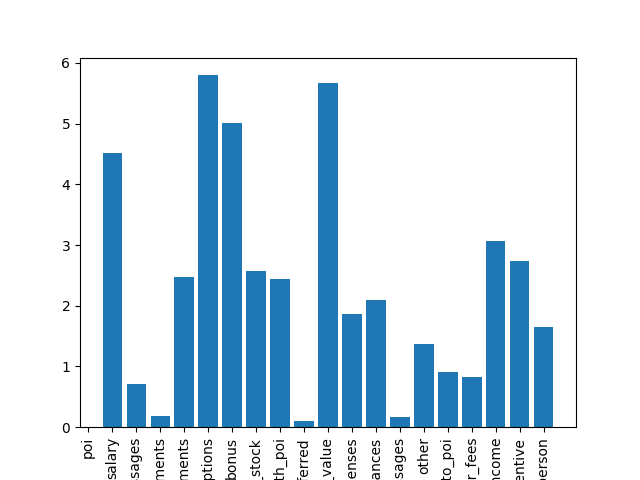
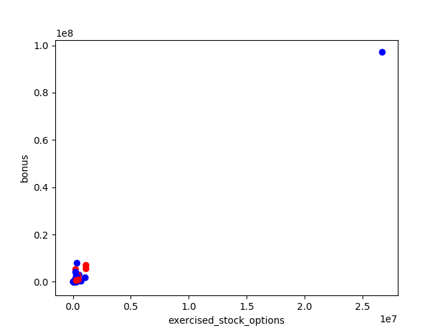
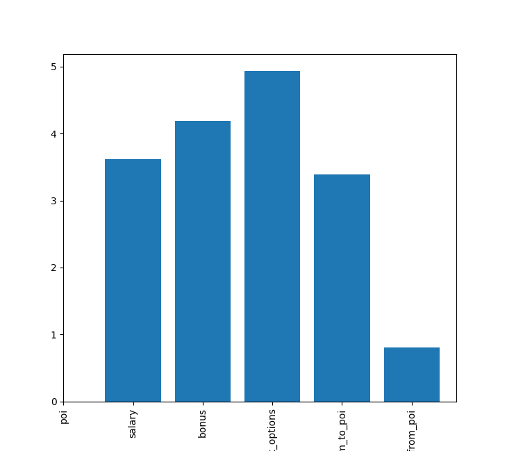

##1
```
### Task 1: Select what features you'll use.
### features_list is a list of strings, each of which is a feature name.
### The first feature must be "poi".
```

1. Eliminate all features that does not really have any data

| Feature   |  Zero/Nan total Count | % of all data points is either NaN/0 |
| --------- | --------------------- | ------------------------------------ |
| loan_advances |   141  | 97.9166666667 |
| director_fees |   128  | 88.8888888889 |
| restricted_stock_deferred |   142  | 88.1944444444 |
| poi |   126  | 87.5 |
| deferral_payments |   107  | 73.6111111111 |
| deferred_income |   144  | 66.6666666667 |
| long_term_incentive |   79  | 54.8611111111 |
| from_this_person_to_poi |   78  | 54.1666666667 |
| from_poi_to_this_person |   70  | 48.6111111111 |
| bonus |   63  | 43.75 |
| shared_receipt_with_poi |   58  | 40.2777777778 |
| to_messages |   58  | 40.2777777778 |
| from_messages |   58  | 40.2777777778 |
| other |   52  | 36.1111111111 |
| salary  |   50  | 34.7222222222 |
| expenses  |   50  | 34.7222222222 |
| exercised_stock_options |   43  | 29.8611111111 |
| restricted_stock  |   36  | 25.0 |
| total_payments  |   20  | 13.8888888889 |
| total_stock_value |   20  | 13.8888888889 |

Chose to remove everything where more then 60% 0 or NaN data points, where a 0 does not make sense. Which is the case for POI.


2. Using SelectKBest To select the top features



Conclusion: I will use SelectKBest as part of the pipline and will include all features where the data has mare than 60% 0/NaN values.

## 2.
```
### Task 2: Remove outliers
```

Plot all data points Salary/Bonus, removed the total data point as it is the sum of all the other features.




## 3.
```
### Task 3: Create new feature(s)
```

Added two new features giving the ratio of emails going to/from this person to a POI
"from_this_person_to_poi", "from_poi_to_this_person", "shared_receipt_with_poi", "to_messages", "from_messages"

| Feature   |  Zero/Nan total Count | % of all data points is either NaN/0 |
| --------- | --------------------- | ------------------------------------ |
| ratio_from_to_poi |   78  | 54.1666666667 |
| ratio_to_from_poi |   70  | 48.6111111111 |

Compared to the best existing features in feature selection



Conclusion is that the feature ```from_this_person_to_poi``` looks to perform better than ```ratio_to_from_poi```


## 4.
```
### Task 4: Try a varity of classifiers
```

This needs to be a supervised classifier, since the label we want is a binary output. Either a POI or not.
### Naive Bays
It is simple, and ignores order, gives fairly good performance using f1 scoring

## Decision true_negatives

parameters
min_simple_split, the size of the leaf node
entropy, how it divides and select data


## Support Vector Machine
Finds hyper plane (line) between classes,

parameters
c - is the tradeoff between smooth and pointy accuracy
gamma - how inferrence by a single point
kernel - rbf/linear

| Classifier   |  Best F1 Score|
| --------- | --------------------- |
| Navie Bays |   0.5 |
| Decision Tree |  0.352941176471  |
| SVM |  0.2  |


With the best classifer Navie Bays is the output

Accuracy: 0.68720	Precision: 0.26118	Recall: 0.73600	F1: 0.38554	F2: 0.53975 Total predictions: 15000	True positives: 1472	False positives: 4164	False negatives:  528	True negatives: 8836

## 5 Tune


### Decision Tree

```
{
  'min_samples_split': 12,
  'class_weight': 'balanced',
  'splitter': 'random',
  'criterion': 'gini'
}
```

### Navie Bays
Navie Bays is untuned, since it does not provide a lot of parameters to play around with.
```
{
}
```

### Support Vector Machine
```
{
  'gamma': 0.005,
  'C': 100000.0
}
```

### Validation
I used f1 validation which combines precision and recall. This gives a more balanced score between being right, and false positives. In general having a good validation method is important to test if it actually finds the things you want, in our case POI. 

## 6 Output

ipeline(steps=[('scaler', StandardScaler(copy=True, with_mean=True, with_std=True)), ('selector', SelectKBest(k='all', score_func=<function f_classif at 0x104dcc5f0>)), ('reducer', PCA(copy=True, iterated_power='auto', n_components=2, random_state=42,
  svd_solver='auto', tol=0.0, whiten=False)), ('classifi...,
  max_iter=-1, probability=False, random_state=None, shrinking=True,
  tol=0.001, verbose=False))])
	Accuracy: 0.68720	Precision: 0.26118	Recall: 0.73600	F1: 0.38554	F2: 0.53975
	Total predictions: 15000	True positives: 1472	False positives: 4164	False negatives:  528	True negatives: 8836
